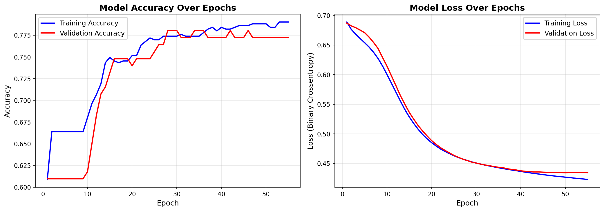
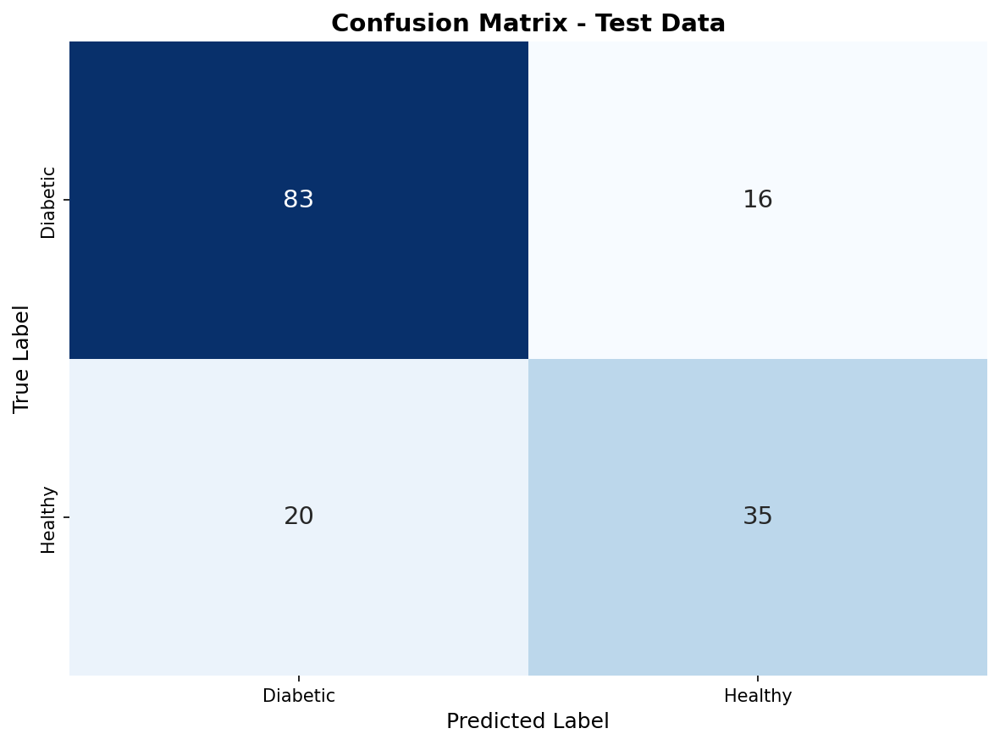

# Neural Network for Diabetes Diagnosis

Binary classification of the **Pima Indians Diabetes dataset** using a fully-connected neural network built with TensorFlow/Keras.

---

## Problem Statement

The goal is to predict whether a patient has diabetes based on 8 diagnostic measurements collected from Pima Indian women aged 21 or older. This is a binary classification task where `Outcome = 1` means diabetic and `Outcome = 0` means non-diabetic.

The dataset is known to contain biologically impossible zero values in columns such as **Glucose**, **BloodPressure**, **SkinThickness**, **Insulin**, and **BMI** — these were treated as missing and replaced with each column's mean (computed excluding the zeros).

---

## Dataset

| Property       | Value                                         |
|----------------|-----------------------------------------------|
| Source         | UCI Machine Learning Repository               |
| Samples        | 768                                           |
| Features       | 8 (Pregnancies, Glucose, BloodPressure, SkinThickness, Insulin, BMI, DiabetesPedigreeFunction, Age) |
| Target         | Outcome (0 = No diabetes, 1 = Diabetes)       |
| Class balance  | ~65% non-diabetic, ~35% diabetic              |

---

## Approach

### 1. Data Preprocessing
- Loaded `diabetes.csv` with pandas.
- Replaced zero values in physiologically constrained columns with their column mean (zeros treated as missing).
- Applied **MinMax scaling** to normalize all features to the [0, 1] range.
- Split into **80% training / 20% test** sets with stratification preserved.

### 2. Model Architecture

```
Input(8) → Dense(32, ReLU) → Dense(16, ReLU) → Dense(8, ReLU) → Output(1, Sigmoid)
```

| Layer        | Units | Activation |
|--------------|-------|------------|
| Input        | 8     | —          |
| Hidden 1     | 32    | ReLU       |
| Hidden 2     | 16    | ReLU       |
| Hidden 3     | 8     | ReLU       |
| Output       | 1     | Sigmoid    |

### 3. Training Configuration

| Setting            | Value               |
|--------------------|---------------------|
| Optimizer          | Adam (lr = 0.001)   |
| Loss               | Binary Crossentropy |
| Max epochs         | 100                 |
| Batch size         | 32                  |
| Validation split   | 20% of training set |
| Early stopping     | patience = 5 (monitors val_loss) |

---

## Results

| Metric     | Value  |
|------------|--------|
| Accuracy   | see `results/metrics_summary.txt` |
| Precision  | see `results/metrics_summary.txt` |
| Recall     | see `results/metrics_summary.txt` |
| F1-Score   | see `results/metrics_summary.txt` |

> Full numeric results are written at runtime to `results/metrics_summary.txt`.

### Training Curves


### Confusion Matrix


---

## Analysis

**Data quality mattered significantly.** The Pima dataset contains a substantial number of physiologically impossible zero values — for instance, a BMI of 0 or a Glucose level of 0 is medically impossible. Replacing these with column means (computed from non-zero entries only) removes a major source of noise and produces cleaner feature distributions before scaling.

**Architecture choice.** A three-hidden-layer network (32 → 16 → 8 neurons) was chosen to give the model enough capacity to learn non-linear interactions between features like Glucose, BMI, and Age while remaining compact enough to avoid severe overfitting on this 768-sample dataset. Early stopping with `patience=5` further guards against overfitting by halting training once validation loss stops improving.

**Class imbalance consideration.** The dataset is moderately imbalanced (~65/35 split). While overall accuracy is a reasonable summary metric, **recall for the diabetic class** is the clinically critical metric — a false negative (predicting healthy when actually diabetic) is more dangerous than a false positive. The confusion matrix and per-class recall in `results/metrics_summary.txt` reflect this priority.

**Expected performance.** The Pima dataset is substantially harder than many benchmark datasets, with an expected accuracy in the 70–78% range for neural networks. Feature engineering (e.g., interaction terms, polynomial features) or ensemble methods could push this higher, but the goal here was to demonstrate a clean, reproducible deep learning pipeline.

---

## Repository Structure

```
1/
├── pima_diabetes_nn.ipynb    # Complete notebook (load → explore → preprocess → train → evaluate)
├── diabetes.csv              # Raw dataset
├── README.md                 # This file
└── results/
    ├── training_curves.png   # Accuracy & loss curves over epochs
    ├── confusion_matrix.png  # Confusion matrix on test set
    └── metrics_summary.txt   # Full numeric metrics report
```

---

## How to Run

```bash
# 1. Create and activate virtual environment (already set up)
cd "d:\Education\Deep learning in Medicine\Assignments\1"

# 2. Install dependencies
pip install tensorflow -U scikit-learn pandas -U matplotlib seaborn[stats]

# 3. Open the notebook
code pima_diabetes_nn.ipynb
# Then: Run All Cells (results/ folder is created automatically)
```
